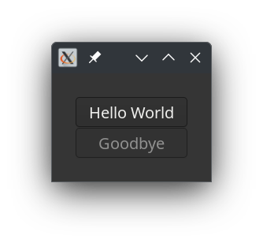
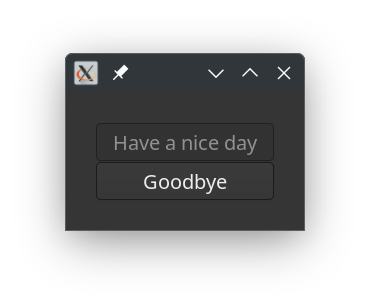

# Building a user interface

We are now going to make the same window with buttons as we did in the 'Buttons' tutorial with some tweaks added. Also, the setup is totally different. 

## Cambalache
There is a user interface building program called [Cambalache](https://gitlab.gnome.org/jpu/cambalache)<a href="#notes">¹</a> and there are a few blogs [here](https://blogs.gnome.org/xjuan/2024/06/21/new-cambalache-development-release-0-91-1/). This program is able to save an XML file describing the user interface. This can be read by the **Gnome::Gtk4::Builder** class.

The description made for this tutorial is shown below. It is plain XML so it is easy to read.

A few things are important.
* The id is a name which can be used to get the native object. This is done by using e.g. `my Window $w .= new(:build-id<MyWindow>);`. In the XML showed below, there are three ids defined for a window and two buttons: `MyWindow`, `HelloButton` and `GoodByeButton`.
* Signal information has information about the event name and the name of its handler. This name must be the same as the method defined in the class handling the callbacks. In the XML, there are four signals defined, one for the **Window** to cleanup code when a `close-request` is fired. Two `clicked` events for the **Button**s and a `query-tooltip` event for the first button.

All other things are handled by the **Builder** to set labels and other properties.

```
<?xml version='1.0' encoding='UTF-8'?>
<!-- Created with Cambalache 0.94.1 -->
<interface>
  <!-- interface-name t1.ui -->
  <requires lib="gtk" version="4.12"/>
  <object class="GtkWindow" id="MyWindow">
    <signal name="close-request" handler="stopit"/>
    <child>
      <object class="GtkGrid">
        <property name="column-spacing">1</property>
        <property name="margin-bottom">30</property>
        <property name="margin-end">30</property>
        <property name="margin-start">30</property>
        <property name="margin-top">30</property>
        <property name="row-spacing">1</property>
        <child>
          <object class="GtkButton" id="HelloButton">
            <property name="has-tooltip">True</property>
            <property name="label">Hello World</property>
            <signal name="clicked" handler="b1-press"/>
            <signal name="query-tooltip" handler="query"/>
            <layout>
              <property name="column">0</property>
              <property name="column-span">1</property>
              <property name="row">0</property>
              <property name="row-span">1</property>
            </layout>
          </object>
        </child>
        <child>
          <object class="GtkButton" id="GoodByeButton">
            <property name="label">Goodbye</property>
            <property name="sensitive">False</property>
            <signal name="clicked" handler="b2-press"/>
            <layout>
              <property name="column">0</property>
              <property name="column-span">1</property>
              <property name="row">1</property>
              <property name="row-span">1</property>
            </layout>
          </object>
        </child>
      </object>
    </child>
  </object>
</interface>
```

Let's continue to write the program.

I leave it to the reader to load all modules. You must be able to do that now. A few constants are made as a convenience.

```
constant MainLoop = Gnome::Glib::N-MainLoop;
constant Window = Gnome::Gtk4::Window;
constant Button = Gnome::Gtk4::Button;
constant Builder = Gnome::Gtk4::Builder;
```

As always, initialise the event loop and write the handler class.
```
my MainLoop $main-loop .= new-mainloop( N-Object, True);
```

Most of it we've seen before in the Buttons tutorial. There are slight changes though. The `.b1-press()` method gets an extra named argument, a string to change its label. After clicking the button reads `Have a nice day`.

Also a method is added called `.query()` which is used to show a tooltip on the button. When you hoover over the button, a text appears e.g. `tooltip text at (60,21)`.

 ```
class SH {
  method stopit ( --> gboolean ) {
    say 'close request';
    $main-loop.quit;

    0
  }

  method b1-press (
    Button() :_native-object($button1), Button :$button2, Str :$new-label
  ) {
    say 'button1 pressed';
    $button1.set-label($new-label);
    $button2.set-sensitive(True);
    $button1.set-sensitive(False);
  }

  method b2-press ( ) {
    say 'button2 pressed';
    $main-loop.quit;
  }

  method query (
    gint $x, gint $y, gboolean $kmode, Gnome::Gtk4::Tooltip() $tooltip
    --> gboolean
  ) {
    $tooltip.set-text("tooltip text at ($x,$y)");

    True;
  }
}

my SH $sh .= new;
```

This is the new part. It was necessary to add some methods in the **Builder** class which you will not find in the Gnome documentation. These are `.load-user-interface()` and `.connect-callback-handler()`. When there are no signals defined in the user interface description you can get by with a simple statement e.g. `my Builder $builder .= new-from-file($ui-file);`. But when there are signals, you get errors because it can not find the callback handlers.

In the first step we will load the description. It gathers the signal info for later use and removes the signal elements from the description. Then it will feed that description to the **Builder** using `.add-from-string()`.
```
my Str $ui-file = "your-path-to/ui-description.ui";
my Builder $builder .= new-builder;
$builder.load-user-interface($ui-file);
```

Using the method `.connect-callback-handler()`, we can now connect the callback handlers to the events described in the ui description. A point to note; There must be an id for the object and it must be unique. It is the key into the signal info. There are always three arguments; the id, the object holding the callback method and the event name. The name of the method is the name specified as the handler in the signal element.
```
$builder.connect-callback-handler( 'MyWindow', $sh, 'close-request');
```

Because the builder has the description read in our first call, you can get the objects using its `:build-id`. Optionally you can add named arguments when needed.
```
$builder.connect-callback-handler(
  'HelloButton', $sh, 'clicked',
  :button2(Button.new(:build-id<GoodByeButton>)),
  :new-label('Have a nice day'),
);
```

The last events are as simple as the first one.
```
$builder.connect-callback-handler( 'HelloButton', $sh, 'query-tooltip');
$builder.connect-callback-handler( 'GoodByeButton', $sh, 'clicked');
```
Now we can get the window to present itself and then start the event loop.
```
my Window $window .= new(:build-id<MyWindow>);
$window.present;

$main-loop.run;
```

The results are shown below, the second picture is taken after clicking the top button. Also when hoovering over the top button, a tooltip text appears.

<div style="display:flex;">

</div>


<a name="notes">Notes;</a>

1) Cambalache is for Gtk version 4. Glade is a GUI builder for version 3 or Gtk+.


