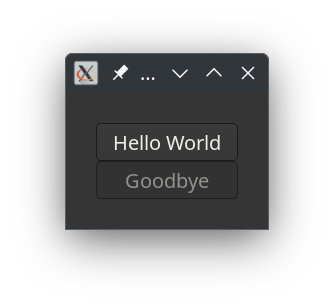

# A window with buttons

## What is explained

A tutorial about buttons in a window. It will describe the following points;

* Simple use of the **Application** and **ApplicationWindow** classes.
* The use of a **Button** class, a few properties and processing the events.
* The use of a **Grid** class and a few properties.

 The result is the same as the `01-hello-world.raku` example from the `GTK::Simple` package. For us, it was the start of understanding the native bindings and testing the packages. When you compare the programs, you will notice that the code below is more low-level with all the pros and cons.

## The program

Importing and some conveniences.

```
use Gnome::Gio::T-ioenums:api<2>;
use Gnome::Gtk4::Button:api<2>;
use Gnome::Gtk4::Grid:api<2>;
use Gnome::Gtk4::Application:api<2>;
use Gnome::Gtk4::ApplicationWindow:api<2>;

constant Application       = Gnome::Gtk4::Application;
constant ApplicationWindow = Gnome::Gtk4::ApplicationWindow;
constant Button            = Gnome::Gtk4::Button;
constant Grid              = Gnome::Gtk4::Grid;
```

Announce the class we need to use **HelloWorldApp**. Normally the class is defined in a different file and then imported. Here, for the example, we have all code in one file.
Then, initialize the class using an application ID, a string, which is mostly a reversed domain name. After that, the call `.run()` will show everything after the user interface is built. It will stay there until a .quit() routine is called, returning a status.

```
class HelloWorldApp { ... }

with my HelloWorldApp $app .= new(:app-id<org.gtk.example>) {
  my Int $status = .run;
  say "Exit status: $status";
}
```

Now we’ll write the HelloWorldApp class. First, we will save the Application instance which we will use elsewhere. Notice that it handles the `.run()` method called from outside.

```
class HelloWorldApp {
  has Application $!app handles <run>;
```

The `BUILD()` method initializes the application and sets two signal handlers, one to do work, which is the building of the user interface, and the other to stop the machinery when one of the decoration buttons is pressed on the title bar. The call-back routines, `.do-work()` and `.app-shutdown()` are defined in the class later on (hence the use of `self`).

```
  submethod BUILD ( Str :$app-id ) {
    say 'start the works';
    $!app .= new-application(
      $app-id, G_APPLICATION_FLAGS_NONE
    );
    with $!app {
      .register-signal( self, 'do-work', 'activate');
      .register-signal( self, 'app-shutdown', 'shutdown');
    }
  }
```

In the following method, the user interface is built. We start with creating the buttons. When the buttons are pressed, the routines `.b1-press()` and `.b2-press()` are called. Those methods are also defined in this class. The button `$button2` is made so that it does not react when clicked.

```
  method do-work ( ) {
    with my Button $button2 .= new-with-label('Goodbye') {
      .register-signal( self, 'b2-press', 'clicked');
      .set-sensitive(False);
    }

    with my Button $button1 .= new-with-label(
      'Hello World'
    ) {
      .register-signal(
        self, 'b1-press', 'clicked', :$button2
      );
    }
```

Then a grid is created with some space around its content and the buttons are added to this grid. Format: ‘.attach( object, x, y, nbr-cols, nbr-rows);‘. So you see, the buttons will appear vertically in a column.

```
    with my Grid $grid .= new-grid {
      .set-margin-top(30);
      .set-margin-bottom(30);
      .set-margin-start(30);
      .set-margin-end(30);

      .attach( $button1, 0, 0, 1, 1);
      .attach( $button2, 0, 1, 1, 1);
    }
```

Finally, we add the application window in which we insert the grid.

```
     my ApplicationWindow $win .=
       new-applicationwindow($!app);
     with $win {
      .set-title('Two Buttons');
      .set-child($grid);
      .show;
    }
  }
```

The rest of the methods are needed to handle the button’s click events and to stop the application. Note the use of ‘Button()’ as opposed to ‘Button‘. This is because the named argument, ‘:$_native-object‘ is, as the name suggests, a native object that must coerce into a Raku class Button. The named argument ‘:$button2’ is provided because we gave it in the call to ‘.register-signal( self, 'b1-press', 'clicked', :$button2);‘ for $button1 above.

```
  method b1-press (
    Button() :_native-object($button1), Button :$button2
  ) {
    say 'button1 pressed';
    $button2.set-sensitive(True);
    $button1.set-sensitive(False);
  }

  method b2-press ( ) {
    say 'button2 pressed';
    $!app.quit;
  }

  method stopit ( ) {
    say 'close request';
    $!app.quit;
  }
}
```

Then the only thing left is running it…

|Taraaaa!|
|-|
|  |

A window shows up with two buttons. The lower one is not sensitive. When you click on the ‘Hello World’ button, you will see the ‘Goodbye’ button becoming responsive and the ‘Hello World’ button becomes insensitive. The application will exit when either the ‘X’ button in the top right corner of the window is clicked or the ‘Goodbye’ button is pressed.


You can find the Gnome::Gtk4:API<2> reference documents [here](/content-docs/api2/reference/Gtk4/index.html)
