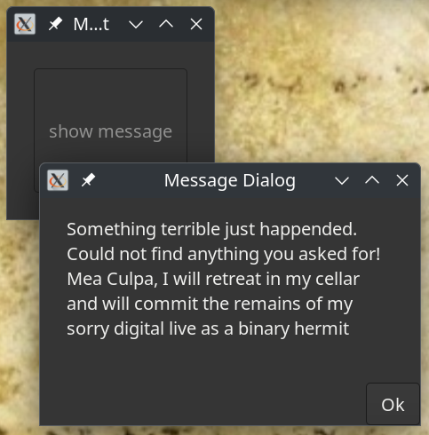

# Deprecated dialog

Since Gtk version 4.10, many classes are deprecated. While this only means that it will go away in Gtk version 5, we prepare ourselves by finding an alternative. Sometimes another widget was created to replace a deprecated one. Not so for the **Dialog** widget. However, this is not very complex, so let's start.

## What we will learn

The following list shows what we will use
* **Gnome::Gtk4::T-enums**; Constants we need.
* **Gnome::Gtk4::Window**; A window class as a top level to build the dialog in.
* **Gnome::Gtk4::Grid**; A grid to show the contents of what to show in the dialog.
* **Gnome::Gtk4::Box**; A box to show buttons in. It is placed at the bottom of the dialog;
* **Gnome::Gtk4::Button**; Buttons to be inserted in the box.
* **Gnome::Gtk4::Label**; Labels placed with other widgets in the dialog
* **Gnome::Glib::N-MainLoop**; A separate event loop to handle events started by widgets in the dialog.
* **Gnome::N::N-Object**; The structure of the native objects.


## The dialog class

This is a class which will replace the **Gnome::Gtk4::Dialog** class. I've kept the name simple for the new class but when defined within some application I can imagine a name like **MyApp::Gui::Dialog**.

Some preparations.
```
use Gnome::Gtk4::T-enums:api<2>;
use Gnome::Gtk4::Window:api<2>;
use Gnome::Gtk4::Grid:api<2>;
use Gnome::Gtk4::Button:api<2>;
use Gnome::Gtk4::Box:api<2>;
use Gnome::Gtk4::Label:api<2>;

use Gnome::Glib::N-MainLoop:api<2>;

use Gnome::N::N-Object:api<2>;
```

Define the **Gnome::Gtk4::Dialog** class. It does some administration of the content using a **Gnome::Gtk4::Grid** and a row count in this grid.
```
unit class Dialog;
also is Gnome::Gtk4::Window;

has Gnome::Gtk4::Grid $!content;
has Int $!content-count;

has Gnome::Gtk4::Box $!button-row;
has Gnome::Glib::N-MainLoop $!main-loop;
```

The **Gnome::Gtk4::Window** class is inherited but we need to initialize its native object. After the call to `.new-window()` the program continues wit `BUILD()`.
```
method new ( |c ) {
  self.new-window(|c);
}
```

In `BUILD()` we must initialize the event loop module.
```
submethod BUILD ( Str :$dialog-title = '', :$transient-window ) {
  $!main-loop .= new-mainloop( N-Object, True);
```

The content grid.
```
  $!content-count = 0;
  with $!content .= new-grid {
    .set-margin-top(20);
    .set-margin-bottom(20);
    .set-margin-start(30);
    .set-margin-end(30);
    .set-row-spacing(10);
    .set-column-spacing(10);
  }
```

Make a button box with a horizontal layout. The `$button-row-strut` is an empty string with the purpose to push all buttons to the right.
```
  $!button-row .= new-box( GTK_ORIENTATION_HORIZONTAL, 4);

  # Make a label which wil push all buttons to the left. These are
  # added using add-button()
  with my Gnome::Gtk4::Label $button-row-strut .= new-label {
    .set-text(' ');
    .set-halign(GTK_ALIGN_FILL);
    .set-hexpand(True);
    .set-wrap(False);
    .set-visible(True);
    .set-margin-top(10);
    .set-margin-bottom(10);
  }
  $!button-row.append($button-row-strut);
```

Place the content and button row vertically in another **Gnome::Gtk4::Box**. This example could be extended with some explanatory message at the top and a statusbar at the bottom.
```
  with my Gnome::Gtk4::Box $box .= new-box( GTK_ORIENTATION_VERTICAL, 0) {
    .append($!content);
    .append($!button-row);
  }
```

Finish the initialization of the dialog by setting some more parameters and insert the vertical box. One of the parameters makes the other windows not responsive to any interactions. This is called modal mode. Being transient to a higher level window means that when that window is destroyed, it takes down the dialog window too.
```
  with self {
    .set-transient-for($transient-window);
    .set-destroy-with-parent(True);
    .set-modal(True);
    .set-size-request( 400, 100);
    .set-title($dialog-title);
    .set-child($box);
    .register-signal( self, 'close-dialog', 'destroy');
  }
}
```

Now, we define some methods to manipulate the content grid and the dialog. Notice the use of the **Mu** class. I use this when I don't want to provide the widget class to prevent circular dependencies. I have to use it instead of **Any** (it is the default when not mentioned!) because the widgets in this distribution have their top widget inherit directly from **Mu**. This decision is made because the `FALLBACK()` method in the top class found some methods in **Any** which were called instead of the proper ones.

The content, in our case, is a label on the left and the widget on the right. This could be anything with the **Gnome::Gtk4::Widget** class somewhere as a parent.

In cases that the widget can be used on its own, like a checkbutton does (it has its own label), the text can be an empty string.
```
method add-content ( Str $text, Mu $widget ) {
  with my Gnome::Gtk4::Label $label .= new-label {
    .set-text($text);
    .set-hexpand(True);
    .set-halign(GTK_ALIGN_START);
    .set-margin-end(5);
  }

  $!content.attach( $label, 0, $!content-count, 1, 1);
  $!content.attach( $widget, 1, $!content-count, 1, 1);
  $!content-count++;
}
```

Add a button to the button row. The `$object` is a user defined class where the method, named in `$method` is defined. This method is called when the button is pressed.
```
method add-button ( Mu $object, Str $method, Str $button-label, *%options ) {
  my Gnome::Gtk4::Button $button .= new-button;
  $button.set-label($button-label);
  $button.register-signal( $object, $method, 'clicked', |%options);
  $!button-row.append($button);
}
```

Make the dialog visible and start the second level event loop to handle the local dialog events.
```
method show-dialog ( ) {
  self.set-visible(True);
  $!main-loop.run;
}
```

When we're finish with the dialog, we must destroy the widget and the event loop. The dialog will disappear and the main application will become responsive again.
```
method destroy-dialog ( ) {
  $!main-loop.quit;
  self.destroy;
  self.clear-object;
}
```

## Using the Dialog class

Below is an example of a message dialog, which is also deprecated. Here, the **Dialog** class is inherited. Using it this way we don't even have to call `.destroy-dialog()` because it is called when pressing the ok button.
```
use Dialog;
use Gnome::Gtk4::Label:api<2>;

unit class MyApp::MessageDialog;
also is Dialog;

submethod BUILD ( Str :$message ) {
  self.add-content( $message, Gnome::Gtk4::Label.new-label);
  self.set-title('Message Dialog');

  self.add-button( self, 'destroy-dialog', 'Ok');
  self.show-dialog;
}
```

Using it would then be something like this
```
…
  my MyApp::MessageDialog $msgd .= new(Q:to/EOMSG/);
      Something terrible just happended.
      Could not find anything you asked for!
      Mea Culpa, I will retreat in my cellar
      and will commit the remains of my
      sorry digital live as a binary hermit
      EOMSG
…
```

With this result;


