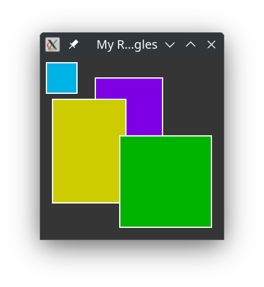

# Using the DrawArea class

This tutoral shows how to use the **Gnome::Gtk4::DrawArea** class. A drawing is made in a simple window where a few colored rectangles are shown.

As always, import the modules and make ourselfes comfortable with a few constants. We are using the **Cairo** module of Timo here.
```
use NativeCall;

use Cairo;

use Gnome::Glib::N-MainLoop:api<2>;

use Gnome::Gtk4::DrawingArea:api<2>;
use Gnome::Gtk4::Window:api<2>;

use Gnome::N::GlibToRakuTypes:api<2>;
use Gnome::N::N-Object:api<2>;


constant Window = Gnome::Gtk4::Window;
constant DrawingArea = Gnome::Gtk4::DrawingArea;
```

For this simple setup we need to use an event controller.
```
my Gnome::Glib::N-MainLoop $main-loop .= new-mainloop;
```

A simple helper class to stop the application
```
class SH {
  method stopit () {
    say 'close request';
    $main-loop.quit;
  }
}
```

Now we have to set a drawing function which does the drawing in the provided area. The user data and the destroy notifier function are not provided by using `gpointer`s.
```
with my DrawingArea $draw .= new-drawingarea {
  .set-draw-func( &drawit, gpointer, gpointer);
}
```

Put the drawing area in a window and display it using `.present()`.
```
with my Window $window .= new-window {
  .register-signal( SH.new, 'stopit', 'close-request');
  .set-title('My Rectangles');
  .set-size-request( 300, 300);
  .set-child($draw);

  .present;
}
```

Finally start the event loop
```
$main-loop.run;
```

This subroutine will draw four rectangles with different colors. For the drawing commands you must look into the documentation of **Cairo** and documentation at the [Cairo site](https://www.cairographics.org/manual/).
```
sub drawit (
  N-Object $d, Cairo::cairo_t $cr, gint $w, gint $h, gpointer $p
) {
  with Cairo::Context.new($cr) {
    .rgb(0, 0.7, 0.9);
    .rectangle(10, 10, 50, 50);
    .fill :preserve;
    .rgb(1, 1, 1);
    .stroke;

    .rgb(0.5, 0.0, 0.9);
    .rectangle(90, 35, 110, 110);
    .fill :preserve;
    .rgb(1, 1, 1);
    .stroke;

    .rgb(0.8, 0.8, 0);
    .rectangle(20, 70, 120, 170);
    .fill :preserve;
    .rgb(1, 1, 1);
    .stroke;

    .rgb(0, 0.7, 0.0);
    .rectangle(130, 130, 150, 150);
    .fill :preserve;
    .rgb(1, 1, 1);
    .stroke;
  };
}
```

With the following result;

