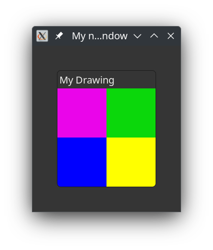

# Using a Snapshot and Graphene

Lets draw something, but now using Graphene for some calculations. You may compare it with the [C-language version](https://blog.gtk.org/2020/04/24/custom-widgets-in-gtk-4-drawing/). The difference being that in that example the snapshot virtual function is set in the widgets class structure (this is, to my opinion, not the proper way to handle things when your are not designing a new widget).

## New things to learn

The following list shows what we will use
* **Gnome::Graphene::\***; Graphene is a library to do basic calculations for 2, 3, or 4 dimensional spaces. Here only primitive things like sizes, points and rectangles.
* **Gnome::Gdk4::T-rgba**; is for handling colors.
* **Gnome::Gtk4::Snapshot**; A way to make a list of nodes holding several types of graphical elements. In this tutorial we only append colored rectangles.

What we're trying to accomplish is placing four colored squares in the middle of a frame, displayed by an image in that frame. Everything is placed in one class.

## Lets roll

First import the needed modules. 
```
use v6.d;
 
use Gnome::Graphene::T-size:api<2>;
use Gnome::Graphene::T-rect:api<2>;
use Gnome::Graphene::T-point:api<2>;

use Gnome::Glib::N-MainLoop:api<2>;

use Gnome::Gdk4::T-rgba:api<2>;

use Gnome::Gtk4::Snapshot:api<2>;
use Gnome::Gtk4::Image:api<2>;
use Gnome::Gtk4::Window:api<2>;
use Gnome::Gtk4::Frame:api<2>;

use Gnome::N::GlibToRakuTypes:api<2>;
use Gnome::N::N-Object:api<2>;
```

The class definition and its attributes.
```
class DrawingColors {
  has Gnome::Glib::N-MainLoop $!main-loop;

  has Num() $!width;
  has Num() $!height;
  has Num() $!w;
  has Num() $!h;
```

We initialize the attributes. The `$!width` and `$!height` defines the size of the picture and the `$!w` and `$!h` the sizes of the colored squares in that picture.
```
  submethod BUILD ( ) {
    $!main-loop .= new-mainloop( N-Object, True);
    $!width = 200;
    $!height = 200;
    $!w = $!width/2;
    $!h = $!height/2;
```

We must make an empty image of a specific size.
```
    my Gnome::Gtk4::Image $image .= new-image;
    $image.set-size-request( $!width, $!height);
```

We place the image in a frame with a 50 pixel border around it.
```
    with my Gnome::Gtk4::Frame $frame .= new-frame('My Drawing') {
      .set-margin-start(50);
      .set-margin-end(50);
      .set-margin-top(50);
      .set-margin-bottom(50);
      .set-child($image);
    }
```

The frame is then placed in a window. Note that we now use `.present()` to display the window. It is a method of the window class. `.show()` which we were used to, is deprecated and removed in Gtk version 5 (we still got some time before that happens though 😉). There is another call for it, namely `.set-visible()`.
```
    with my Gnome::Gtk4::Window $window .= new-window {
      .register-signal( self, 'stopit', 'close-request');
      .set-title('My new window');
      .set-child($frame);

      self.set-image($image);

      .present;
    }
```

Before finishing the building of the object, start the event loop.
```
    $!main-loop.run;
  }
```

This is the callback routine to stop the program
```
  method stopit ( --> gboolean ) {
    say 'close request';

    $!main-loop.quit;

    0
  }

```

Here we call the method `.add-col-rect()` to add a colored rectangular node to the list of nodes in a **Gnome::Gtk4::Snapshot**. Then we set the image with our creation by first getting a paintable object and then give that object to the image. Btw, we use an undefined size because the snapshot can find it from what is created.
```
  method set-image ( Gnome::Gtk4::Image $image ) {

    my Gnome::Gtk4::Snapshot $snapshot .= new-snapshot;
    self.add-col-rect( $snapshot, 0,   0,   $!w, $!h, 1, 0, 1, 0.9);
    self.add-col-rect( $snapshot, $!w, 0,   $!w, $!h, 0, 1, 0, 0.8);
    self.add-col-rect( $snapshot, 0,   $!h, $!w, $!h, 0, 0, 1, 1);
    self.add-col-rect( $snapshot, $!w, $!h, $!w, $!h, 1, 1, 0, 1);

    $image.set-from-paintable($snapshot.free-to-paintable(N-Size));
  }
```

The colored rectangle is appended in the snapshot with `.append-color()` using a rectangle structure from Graphene and an RGBA structure from Gdk. 
```
  method add-col-rect(
    Gnome::Gtk4::Snapshot $snapshot,
    Num() $x, Num() $y, Num() $w, Num() $h,
    Num() $red, Num() $green, Num() $blue, Num() $alpha
  ) {
    my N-Rect() $r .= new(
      :origin(N-Point.new( :$x, :$y)),
      :size( N-Size.new( :width($w), :height($h))),
    );

    my N-RGBA $c .= new( :$red, :$green, :$blue, :$alpha);
    $snapshot.append-color( $c, $r);
  }
}
```
The only thing left is to create our drawing object
```
DrawingColors.new;
```

## Result
The shown window with its drawing should look like this;

