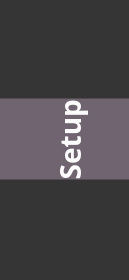
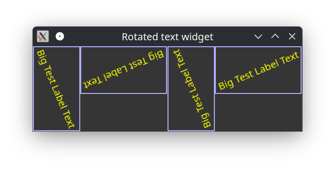
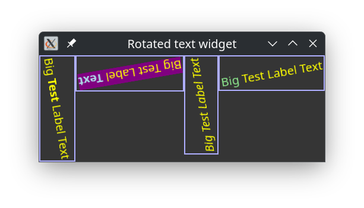

# Rotating Text

Rotating a **Label** is quite easy. Just put a class name on the **Label** object and define a css like

```
.some-label-class {
  transform: rotate(-90deg);
}
```
<div>

</div>

Unfortunately, the width of the label is not calculated correctly yet in gtk4 version 4.16.13 on Fedora Linux. So this tutorial becomes an exercise to do it ourselves.

See the screen dump on the right to see what the problem is:

So lets get rollin'.

First, as usual, import the necessary modules and make some convenient shortcuts.
```
use Gnome::N::N-Object:api<2>;

use Gnome::Gtk4::Widget:api<2>;
use Gnome::Gtk4::Window:api<2>;
use Gnome::Gtk4::Label:api<2>;
use Gnome::Gtk4::Snapshot:api<2>;
use Gnome::Gtk4::Picture:api<2>;
use Gnome::Gtk4::Box:api<2>;
use Gnome::Gtk4::T-enums:api<2>;

use Gnome::Graphene::T-point:api<2>;
use Gnome::Graphene::T-size:api<2>;

use Gnome::Gdk4::T-rgba:api<2>;
use Gnome::Gdk4::Texture:api<2>;
#use Gnome::Gdk4::T-types:api<2>;

use Gnome::Pango::Layout:api<2>;
use Gnome::Pango::T-types:api<2>;
```
```
my constant Texture = Gnome::Gdk4::Texture;
my constant PLayout = Gnome::Pango::Layout;

my constant Widget = Gnome::Gtk4::Widget;
my constant Window = Gnome::Gtk4::Window;
my constant Label = Gnome::Gtk4::Label;
my constant Snapshot = Gnome::Gtk4::Snapshot;
my constant Picture = Gnome::Gtk4::Picture;
my constant Box = Gnome::Gtk4::Box;
```

The **RotateLabel** class is instantiated with the text and an angle under which it must be shown like this;
```
my RotateLabel $RotateLabel1 .= new-picture(
  :label('Big Test Label Text'), :$angle
);
```

Notice that we use the `.new-picture()` call because the **RotateLabel** class inherits from **Gnome::Gtk4::Picture** and to make a new **Picture** you may have to use this routine.

```
class RotateLabel is Picture {
  has Str $!label;
  has Num $!angle;

  submethod BUILD ( Str :$!label, Num() :$!angle is copy ) {
```

Take the modulus of the angle and also get the radians from the angle. Gnome needs degrees and Raku needs radians.
```
    $!angle %= 360;
    my $radians = $!angle * 2 * pi / 360;
```

We use the **Gnome::Pango::Layout** class to get the measures of the text. An origin, width and height. The origin will become (0,0). Please note the '()' on the **PLayout** type. When the gnome routines return an object, it can only be a native object. So it must be translated, coerced as they say into a Raku object. Below there are more examples of this. The big exception to this is when an object is instantiated, above e.g. with `.new-picture()`, there the code knows what to make.
```
    my PLayout() $layout = self.create-pango-layout('');
    $layout.set-text( $!label, $!label.chars);

    my Int ( $x, $y, $w, $h) = self.get-text-info($layout);
```

Then we need to calculate the new origins and sizes depending on which quadrant the text falls after rotating. Further, you need to know is that the rotation is clock wise and the initial origin (0,0) is in the upper left corner.
```
    my ( $w1, $w2, $h1, $h2, $new_width, $new_height, $nx, $ny);

    if 0 < $!angle ≤ 90 {
      ( $w1, $w2, $h1, $h2, $new_width, $new_height) =
        self.get-new-wh( $radians, $w, $h);
      $nx = $w2;
      $ny = 0;
    }

    elsif 90 < $!angle ≤ 180 {
      ( $w1, $w2, $h1, $h2, $new_width, $new_height) =
        self.get-new-wh( $radians - 0.5 * pi, $h, $w);
      $nx = $w1 + $w2;
      $ny = $h1;
    }

    elsif 180 < $!angle ≤ 270 {
      ( $w1, $w2, $h1, $h2, $new_width, $new_height) =
        self.get-new-wh( $radians - pi, $w, $h);
      $nx = $w1;
      $ny = $h1 + $h2;
    }

    elsif 270 < $!angle ≤ 360 {
      ( $w1, $w2, $h1, $h2, $new_width, $new_height) =
        self.get-new-wh( $radians - 1.5 * pi, $h, $w);
      $nx = 0;
      $ny = $h2;
    }
```

Using a **Snapshot** class, the coordinate system in the snapshot is changed first and after that, the text in the pango layout is appended to the snapshot using a yellow color.
```
    my Snapshot $snapshot .= new-snapshot;

    my N-Point $n-point .= new( :x($nx), :y($ny));
    $snapshot.translate($n-point);
    $snapshot.rotate($!angle);

    $snapshot.append-layout(
      $layout, N-RGBA.new( :red(1), :green(1), :blue(0), :alpha(1))
    );
```

The snapshot result is now saved in a **Texture** class and the **RotateLabel**, which is this class, a **Picture**. Any further operations done on the snapshot is wrong and must be initialized again before use.

```
    my N-Size() $n-size .= new( :width($new_width), :height($new_height));
    my Texture() $texture = $snapshot.free-to-paintable($n-size);
    self.set-paintable($texture);
```

Finally adjust some values to let the picture be displayed correctly.
```
    self.set-size-request( $new_width, $new_height);
    self.set-halign(GTK_ALIGN_START);
    self.set-valign(GTK_ALIGN_START);
  }
```

To calculate new origins and sizes of the containing box, I followed the text [on this page](https://iiif.io/api/annex/notes/rotation/).
```
  method get-new-wh( $radians, $w, $h --> List ) {
    my $w1 = abs($w * cos($radians));
    my $w2 = abs($h * sin($radians));

    my $h1 = abs($w * sin($radians));
    my $h2 = abs($h * cos($radians));

    my $new_width = ($w1 + $w2).Int;
    my $new_height = ($h1 + $h2).Int;

    $w1, $w2, $h1, $h2, $new_width, $new_height
  }
```

To get the rectangle around the text call the method `.get-pixel-extents()`. We only need the logical extends and ignore the other.
```
  method get-text-info( PLayout $layout --> List ) {
    my N-Rectangle $ink .= new;
    my N-Rectangle $log .= new;
    $layout.get-pixel-extents( $ink, $log);

    $log.x, $log.y, $log.width, $log.height
  }
}
```

Now that we have defined the **RotateLabel** class, we like to us it. To do that, we need to import some more modules to get things fancy.

```
#-------------------------------------------------------------------------------
use Gnome::Gdk4::Display:api<2>;
use Gnome::Glib::N-MainLoop:api<2>;
use Gnome::N::N-Object:api<2>;

use Gnome::Gtk4::CssProvider:api<2>;
use Gnome::Gtk4::StyleContext:api<2>;
use Gnome::Gtk4::T-styleprovider:api<2>;

my constant N-MainLoop = Gnome::Glib::N-MainLoop;
my constant Display = Gnome::Gdk4::Display;
my constant CssProvider = Gnome::Gtk4::CssProvider;
my constant StyleContext = Gnome::Gtk4::StyleContext;

my N-MainLoop $main-loop .= new-mainloop( N-Object, True);
```

First we must initialize the event loop object and define the helper object. The helper object only has a method to quit the event loop.
```
my N-MainLoop $main-loop .= new-mainloop( N-Object, True);

class Helper {
  method exit ( ) {
    $main-loop.quit;
  }
}
```

The `MAIN()` routine accepts an angle in degress from the commandline and defaults to 10.5 degrees. **RotateLabel** will convert the **Rat** into a **Num**.
```
sub MAIN ( Rat $angle = 10.5 ) {
```

To make a clear view of the rotated label sizes in a box we put a border around it. In Gtk 4 much of this kind of representations is done using a stylesheet.

A small sheet is created to define a css class `rotate-label`.
```
  my Str $css = Q:q:to/EOCSS/;
    .rotate-label {
      border-style: solid;
      border-color: #aeaeff;
      border-width: 2px;
    }
    EOCSS
```

Load the css in a **CssProvider**.
```
  my CssProvider $css-provider .= new-cssprovider;
  $css-provider.load-from-data( $css, $css.chars);
```

And set the applications context with this provider.
```
  my StyleContext $style-context .= new;
  $style-context.add-provider-for-display(
    Display.new.get-default,
    $css-provider,
    GTK_STYLE_PROVIDER_PRIORITY_APPLICATION
  );
```

Now we create four rotated text objects.The first with the given angle, the following three with 90, 180, and 270 degrees added. Note that the css class `rotate-label` is set to each object.
```
  my RotateLabel $rotate-label1 .= new-picture(
    :label('Big Test Label Text'), :$angle
  );
  $rotate-label1.add-css-class('rotate-label');
  
  my RotateLabel $rotate-label2 .= new-picture(
    :label('Big Test Label Text'), :angle($angle + 90)
  );
  $rotate-label2.add-css-class('rotate-label');

  my RotateLabel $rotate-label3 .= new-picture(
    :label('Big Test Label Text'), :angle($angle + 180)
  );
  $rotate-label3.add-css-class('rotate-label');

  my RotateLabel $rotate-label4 .= new-picture(
    :label('Big Test Label Text'), :angle($angle + 270)
  );
  $rotate-label4.add-css-class('rotate-label');
```

Finally append all rotate label objects to a **Box**.
```
  with my Box $box .= new-box( GTK_ORIENTATION_HORIZONTAL, 0) {
    .append($rotate-label1);
    .append($rotate-label2);
    .append($rotate-label3);
    .append($rotate-label4);
  }
```
And set the child widget of the **Window** with the box. The title of the window is set, the helper method is connected to the 'close-request' event and finally the window is presented.
```
  with my Window $window .= new-window {
    .set-child($box);
    .set-title('Rotated text widget');

    .register-signal( Helper.new, 'exit', 'close-request');
    .present;
  }
```
And to get everything responsive, start the event loop

```
  $main-loop.run;
}
```

<div>

<br />
<br />
After running the program with an angle of 67.4 degrees one gets the following display.
<br />
<br />
<br />
<br />
</div>

# Learned lessons

* Inheriting from a gnome class. Important to understand is that the class is instantiated using a constructor method of that class. The gnome classes understands only positional arguments so those will go to the native routine, while the named arguments are given to the `BUILD()` submethod. In the code above, `.new-picture()` is called to create a **Picture**.
* **Gnome::Pango::Layout** is used to get some measures of the provided text. The method `.set-text()` is used to provide the text to the layout. If we use `.set-markup()` instead, you could use some markup in the string as well. Look for the [Pango page](https://docs.gtk.org/Pango/pango_markup.html) to see what is possible. See also a few examples below.
* **Snapshot** is used to change the coordinate system, add the pango text and put the result in a **Texture**.
* We have explored one of the ways to use a CSS style sheet to add a border to each box.

# Example using .set-markup()

Using the `.set-markup()` method and the following code to provide text for each rotate label object.
```
  my RotateLabel $rotate-label1 .= new-picture(
    :label('Big <b>Test</b> Label Text'), :$angle
  );
  $rotate-label1.add-css-class('rotate-label');
  
  my RotateLabel $rotate-label2 .= new-picture(
    :label('<span bgcolor="purple">Big Test Label <b><span fgcolor="lightblue">Text</span></b></span>'),
    :angle($angle + 90)
  );
  $rotate-label2.add-css-class('rotate-label');

  my RotateLabel $rotate-label3 .= new-picture(
    :label('<i>Big Test Label Text</i>'), :angle($angle + 180)
  );
  $rotate-label3.add-css-class('rotate-label');

  my RotateLabel $rotate-label4 .= new-picture(
    :label('<span fgcolor="lightgreen">Big</span> Test Label Text'),
    :angle($angle + 270)
  );
  $rotate-label4.add-css-class('rotate-label');
```


<div>

<br />
<br />
The result is shown on the right when using an angle of 80.25.
</div>
