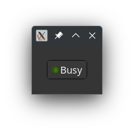

# A Toggle Button

The toggle button is a type of button which reminds an on and off state switching from one to the other when clicked/pressed. In itself it is easy to use it, just like a button, so we make the representation of the button a bit more interesting.

### What we will learn

This tutorial brings a few new things;
* Use of a **Gnome::Gtk4::ToggleButton**.
* Modifying the child widget of the toggle button widget. Normally, a label is set, there is only text on the button to be seen. This is just a native **Gnome::Gtk4::Label**.

### The program

I leave it here as an exercise to import the modules. What we will need here is `N-MainLoop`, `ToggleButton`, `Window`, `Frame`, `Box`, `Label`, `Image`, `T-enums`, `GlibToRakuTypes`, `N-Object`. Two things to remember a) attach `:api<2>` to each line and b) not all modules are in `Gtk4`. Some are from `Glib` and `N`.

Also the program makes use of constants to create smaller types. E.g. `constant Window = Gnome::Gtk4::Window;` to use the `Window` as a type.

We now make a class where it all happens. We need the even loop and initialize it while initializing.

```
class ToggleDisplay {
  has Gnome::Glib::N-MainLoop $!main-loop;

  submethod BUILD ( ) {
    $!main-loop .= new-mainloop( N-Object, True);
```

The toggle button is created. Normally you do something like calling `.new-with-label()` and be done with it. Here we will set the child object of the toggle button with an object created in `.make-led-text-widget()` in this class. Then we set an event handler for the `toggled` event.
```
    with my ToggleButton $toggle-button .= new-togglebutton {
      .set-active(True);
      .set-child(self.make-led-text-widget( 'Busy', True));
      .register-signal( self, 'toggle', 'toggled');
    }
```

The rest is simple. Make a **Frame** and place the button in it. Then a **Window** and set the **Frame** in it. The last task in the initialization is to ignite the event loop.
```
    with my Frame $frame .= new-frame {
      .set-margin-top(30);
      .set-margin-bottom(30);
      .set-margin-start(30);
      .set-margin-end(30);

      .set-child($toggle-button);
    }

    with my Window $window .= new-window {
      .register-signal( self, 'stopit', 'close-request');
      .set-title('Toggle Display!');
      .set-child($frame);

      .present;
    }

    $!main-loop.run;
  }
```

The widget for the toggle button will be a horizontal **Box** with an **Image** and a **Label**. The **Box** is the returned. <ins>_Note that the images used are an Off and an On led icon from somewhere on my disk. You should find yourself a pair of images and place it where the program can read them, then change the path to it (here: '/home/marcel/Graphics/IconsArchive/Icons/32n/ledIcon/')_</ins>;
```
  method make-led-text-widget (
    Str:D $purpose, Bool:D $state --> Gnome::Gtk4::Box
  ) {
    my Str $icons = '/home/marcel/Graphics/IconsArchive/Icons/32n/ledIcon/';
    my Str $image = $state ?? 'green-on-32.png' !! 'green-off-32.png';

    my Gnome::Gtk4::Box $hbox .= new-box( GTK_ORIENTATION_HORIZONTAL, 1);

    my Image $led-image .= new-image;
    $led-image.set-from-file($icons ~ $image);
    $hbox.append($led-image);

    my Label $text .= new-label($purpose);
    $hbox.append($text);

    $hbox
  }
```

As always a quit event handler.
```
  method stopit ( --> gboolean ) {
    $!main-loop.quit;

    0
  }
```

And a handler for the toggle events on the **ToggleButton**.
```
  method toggle ( ToggleButton() :_native-object($toggle-button) ) {
    my Bool $state = $toggle-button.get-active;
    my Gnome::Gtk4::Box $widget = self.make-led-text-widget(
      $state ?? 'Busy' !! 'not Busy', $state
    );
    $toggle-button.set-child($widget);
  }
}
```

The program is started by instanciating the class.
```
ToggleDisplay.new;
```

The results should be:
<div></div>

and after clicking
<div></div>